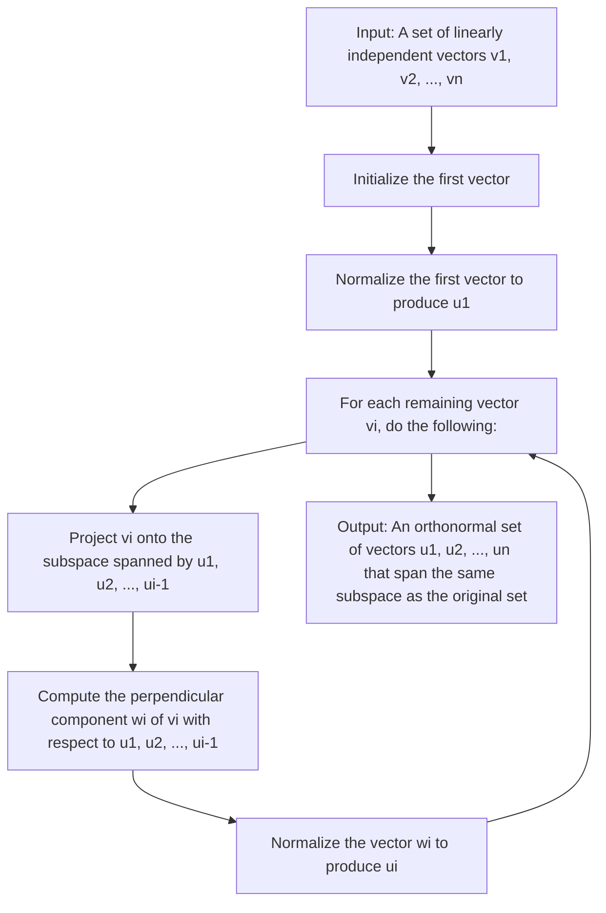

# What does orthogonal mean?

In mathematics, two vectors are said to be orthogonal if they are perpendicular to each other. Geometrically, this means that the angle between the two vectors is 90 degrees or π/2 radians.

More generally, in linear algebra, a set of vectors is said to be orthogonal if every pair of vectors in the set is orthogonal to each other. An orthonormal set of vectors is a set of orthogonal vectors of unit length.

Orthogonality is an important concept in many areas of mathematics and physics, particularly in the study of linear transformations and inner product spaces. In applications such as signal processing and quantum mechanics, orthogonal vectors and matrices play a crucial role in the analysis and manipulation of data and physical systems.

# Gram-Schmidt Orthogonalization Process



The Gram-Schmidt orthogonalization process is a mathematical procedure used to convert a set of linearly independent vectors into a set of orthogonal vectors. This process is named after Jørgen Pedersen Gram and Erhard Schmidt, who independently developed it in the late 19th century.

The process starts with a set of linearly independent vectors {v1, v2, ..., vn} in an n-dimensional vector space. The first step is to normalize the first vector v1 by dividing it by its length or magnitude:
```
u1 = v1 / ||v1||
```
where ||v1|| is the length or magnitude of v1. This creates a unit vector u1 in the direction of v1.

The second step is to project the second vector v2 onto the subspace spanned by u1, which is the line passing through the origin and u1. This projection is given by:
```
proj_u1(v2) = (v2 . u1) u1
```
where . denotes the dot product of two vectors. The vector v2 can be decomposed into two parts: one parallel to u1 and the other perpendicular to u1. The parallel component is given by the projection, while the perpendicular component is given by:
```
w2 = v2 - proj_u1(v2)
```
The vector w2 is then normalized to produce the second orthogonal vector:
```
u2 = w2 / ||w2||
```
The process is repeated for the remaining vectors, producing a set of n orthogonal vectors {u1, u2, ..., un} that span the same subspace as the original set of vectors.

The Gram-Schmidt process can be used to find an orthonormal basis for a subspace, which is useful in many applications such as linear regression, signal processing, and quantum mechanics.
